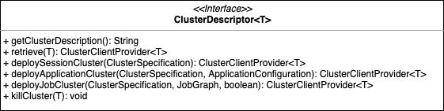

# Flinkful

## Why Flinkful?

Flink is a popular stateful compute engine and it has provided a few ways for management such as cli, http, python and scala REPLs,  which would only satisfy some purposes and people have to choose one or  all of them for needs.

I have done some exciting work which developed generic Java flink client supporting submit jobs、access cluster  and jobs status, and more features to be adding. Through it, I believed people can concern more on how to manage and maintain flink infrastructure prevent by the absence of Java client.

## How Flinkful?

As mentioned [here](https://nightlies.apache.org/flink/flink-docs-release-1.14/docs/deployment/overview/), Flink consists of `JobManager`, `TaskManager` and `client`. After `JobManager` bootstraped, people can access Flink cluster with runtime-webui by http, In fact, most Flink cluster and job status can be obtained by http.

Flink supports 3 deployment mode:

* Application
* Per-Job
* Session

Application and Per-Job deployment mode will create a new Flink cluster through resource providers such as YARN or Kubernetes, so Flink http API is limited on job submission for http API based on `JobManager`。

Except that, there is `WebOptions#SUBMIT_ENABLE` option indicating whether jobs can be uploaded and run from the web-frontend.

Flinkful consists of two module: `flinkful-cli` and `flinkful-rest`, the former for submiting jobs and latter for cluster and job status accessment.

### Job Submission

#### `ClusterDescriptor`

For complex deployment ways, it is also a challenage for Flink on how to design cluster client API and `ClusterDescriptor` would be the answer.

Through `ClusterDescriptor`, Flink can create deployment mode cluster on different resource providers:

* `#deploySessionCluster` creates Session cluster.
* `#deployApplication` creates Application cluster.
* `#deployJobCluster` creates Per-Job Cluster.

For different resource providers, Flink provides corresponding implementation:

* `StandaloneClusterDescriptor` supports `RemoteExecutor#NAME`.
* `YarnClusterDescriptor` supports `YarnDeploymentTarget#APPLICATION`, `YarnDeploymentTarget#PER_JOB`, `YarnDeploymentTarget#SESSION`.
* `KubernetesClusterDescriptor` supports `KubernetesDeploymentTarget#APPLICATION`, `KubernetesDeploymentTarget#SESSION`.

With the helpment of `ClusterDescriptor`, Flinkful provides `flinkful-cli-descriptor` for submiting jobs by `ClusterClient`.

#### `CliFrontend`

cli interface is Flink job entrypoint, 

### Access cluster and job status

